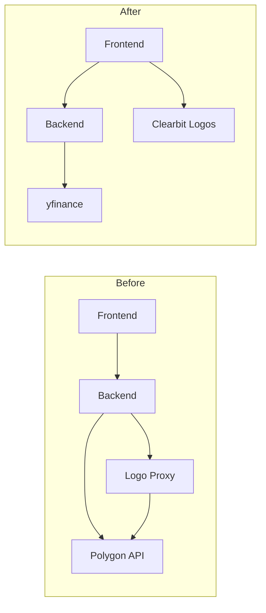

# Migrate from Polygon to yfinance

## Overview

Replace Polygon.io API (requires API key) with yfinance (no API key) so demo participants can clone and run without configuration.

## Architecture Change

## Files to Change

### Backend

1. **[backend/src/app/config.py](backend/src/app/config.py)**
  - Remove `POLYGON_API_KEY` requirement and validation
  - Remove `POLYGON_BASE_URL` and `POLYGON_TIMEOUT` constants
2. **Create [backend/src/app/yfinance_client.py](backend/src/app/yfinance_client.py)**
  - New client wrapping yfinance
  - `get_ticker_overview()` - map yfinance `Ticker.info` to existing response shape
  - `get_financials()` - map yfinance financials DataFrames to existing response shape
  - Derive Clearbit logo URL from company website
3. **[backend/src/app/main.py](backend/src/app/main.py)**
  - Replace `polygon_client` import with `yfinance_client`
  - Remove startup/shutdown lifecycle (yfinance is synchronous, wrapped in async)
  - Update `/api/ticker/{ticker}` to use yfinance client
  - Update `/api/ticker/{ticker}/financials` to use yfinance client
  - Remove `/api/proxy/logo` endpoint (no longer needed)
4. **Delete [backend/src/app/polygon.py](backend/src/app/polygon.py)**

### Frontend

1. **[frontend/components/ticker-overview.tsx](frontend/components/ticker-overview.tsx)**
  - Update logo URL to use Clearbit directly (no proxy)
  - Remove FIGI fields (`composite_figi`, `share_class_figi`) from UI
  - Keep `AvatarFallback` as-is for missing logos
2. **[frontend/components/financials.tsx](frontend/components/financials.tsx)**
  - Remove "Comprehensive Income" tab (yfinance doesn't provide this)
  - Update tabs from 4 to 3 (Income, Balance Sheet, Cash Flow)
3. **[frontend/app/page.tsx](frontend/app/page.tsx)**
  - Update tagline from "Polygon.io" to "Yahoo Finance"

## Data Mapping

yfinance `Ticker.info` to existing `results` shape:

| Frontend Field       | yfinance Field                                |
| -------------------- | --------------------------------------------- |
| `name`               | `longName` or `shortName`                     |
| `ticker`             | `symbol`                                      |
| `market`             | `market`                                      |
| `primary_exchange`   | `exchange`                                    |
| `market_cap`         | `marketCap`                                   |
| `description`        | `longBusinessSummary`                         |
| `homepage_url`       | `website`                                     |
| `total_employees`    | `fullTimeEmployees`                           |
| `sic_description`    | `industry`                                    |
| `address.city/state` | `city`, `state`                               |
| `branding.logo_url`  | Derived: `https://logo.clearbit.com/{domain}` |

## What Gets Removed

- FIGI identifiers (not in yfinance)
- Comprehensive income statement (not in yfinance)
- Logo proxy endpoint (Clearbit doesn't need auth)
- `POLYGON_API_KEY` env var requirement

## Testing

After migration, verify:

- Ticker overview loads for AAPL, MSFT, etc.
- Financial statements display correctly
- Logos load from Clearbit
- App runs without any env vars (except optional CORS settings)

